# NanoChat Explained: From the Ground Up

**A beginner-friendly guide to understanding how a ChatGPT-like AI works**

---

## Table of Contents
1. [The Big Picture](#the-big-picture)
2. [Step 1: Tokenization - Teaching Computers to Read](#step-1-tokenization---teaching-computers-to-read)
3. [Step 2: The Transformer Model - The Brain](#step-2-the-transformer-model---the-brain)
4. [Step 3: Training - Teaching the AI to Learn](#step-3-training---teaching-the-ai-to-learn)
5. [Step 4: Inference - Using the Trained AI](#step-4-inference---using-the-trained-ai)
6. [The Complete Pipeline](#the-complete-pipeline)
7. [Key Concepts Glossary](#key-concepts-glossary)

---

## The Big Picture

Imagine you want to build a robot that can have conversations like a human. Here's what you need:

```
┌──────────────────────────────────────────────────────────────┐
│                    NANOCHAT PROJECT                          │
│                                                              │
│  Goal: Build a ChatGPT-like AI from scratch                 │
│                                                              │
│  [1] Text → Numbers     (Tokenization)                       │
│  [2] Numbers → Patterns (The Model/Brain)                    │
│  [3] Learn from Data    (Training)                           │
│  [4] Generate Responses (Inference/Chat)                     │
└──────────────────────────────────────────────────────────────┘
```

**The Challenge:** Computers don't understand words - they only understand numbers. So we need to:
1. Convert words into numbers (tokenization)
2. Build a "brain" that can find patterns in those numbers (the model)
3. Teach that brain by showing it lots of examples (training)
4. Use the trained brain to generate new text (inference)

Let's dive into each step!

---

## Step 1: Tokenization - Teaching Computers to Read

### What is Tokenization?

**Simple Explanation:** Tokenization is like giving each word (or piece of a word) a unique ID number.

Think of it like a restaurant menu:
- "Pizza" = Item #42
- "Burger" = Item #17
- "Salad" = Item #89

```
Human Text:    "Hello, world!"
                    ↓
Tokenizer:     Breaks into pieces
                    ↓
Tokens:        ["Hello", ",", " world", "!"]
                    ↓
Token IDs:     [15496, 11, 995, 0]
```

### Why Not Just Use Letters?

Good question! We *could* give each letter a number (a=1, b=2, etc.), but that's inefficient. Instead, we use **Byte-Pair Encoding (BPE)**, which creates a smart vocabulary.

**Analogy:** Imagine you're texting. You could spell out "laugh out loud" every time, but it's faster to use "lol". BPE does something similar - it finds common chunks and gives them their own ID.

### How BPE Works (Step by Step)


**Example:**

```
Step 0: Start with individual bytes
Text: "the cat"
Tokens: ['t', 'h', 'e', ' ', 'c', 'a', 't']

Step 1: "th" appears a lot → merge it
Vocab: ['t', 'h', 'e', ' ', 'c', 'a', 'th']
Text now: ['th', 'e', ' ', 'c', 'a', 't']

Step 2: "the" appears a lot → merge it
Vocab: ['t', 'h', 'e', ' ', 'c', 'a', 'th', 'the']
Text now: ['the', ' ', 'c', 'a', 't']

... continue until we have 65,536 tokens in vocabulary
```

### In NanoChat

**Location:** `nanochat/tokenizer.py`, `rustbpe/` (Rust implementation)

**Key Numbers:**
- **Vocabulary Size:** 65,536 tokens (2^16)
- **Training Data:** ~2 billion characters from the internet
- **Special Tokens:** We add special markers like `<|bos|>` (beginning of sequence), `<|user_start|>`, `<|assistant_start|>` for conversations

**The Process:**
```python
# Training the tokenizer (scripts/tok_train.py)
1. Download 2 billion characters from FineWeb dataset
2. Run BPE algorithm to create 65,536 tokens
3. Save the tokenizer to disk

# Using the tokenizer
tokenizer.encode("Hello, world!")
→ [15496, 11, 995, 0]

tokenizer.decode([15496, 11, 995, 0])
→ "Hello, world!"
```

**ASCII Visualization:**

```
┌─────────────────────────────────────────────────────┐
│              TOKENIZATION PIPELINE                  │
│                                                     │
│  Raw Text:  "The cat sat on the mat"               │
│      ↓                                              │
│  Split:     ["The", " cat", " sat", " on",         │
│              " the", " mat"]                        │
│      ↓                                              │
│  Encode:    [464, 2872, 7731, 319, 262, 2603]      │
│                                                     │
│  [These numbers go into the AI model]               │
└─────────────────────────────────────────────────────┘
```

---

## Step 2: The Transformer Model - The Brain

### What is a Neural Network?

**Simple Explanation:** A neural network is like a huge mathematical function that transforms inputs (token IDs) into outputs (predictions of next token).

**Analogy:** Think of it like a factory assembly line:
- **Input:** Raw materials (token IDs)
- **Processing:** Multiple stations that transform the materials
- **Output:** Finished product (probability of each token being next)

### The Transformer Architecture

The "Transformer" is a specific type of neural network invented in 2017. It's particularly good at understanding sequences (like sentences).

```mermaid
graph TB
    A[Input: Token IDs] --> B[Embedding Layer]
    B --> C[Transform numbers → vectors]
    C --> D[Transformer Block 1]
    D --> E[Transformer Block 2]
    E --> F[... 20 blocks total ...]
    F --> G[Transformer Block 20]
    G --> H[Output Layer]
    H --> I[Probabilities for next token]
```



### Key Components

#### 1. Embeddings - Giving Numbers Meaning

**What:** Convert token ID (just a number) into a **vector** (list of numbers) that captures meaning.

**Example:**
```
Token ID 42 ("cat") → [0.2, -0.5, 0.8, ..., 0.1]  (1280 numbers)
Token ID 17 ("dog") → [0.3, -0.4, 0.7, ..., 0.2]  (1280 numbers)
```

Notice "cat" and "dog" vectors are similar because they're both animals!

**In Code (gpt.py:159):**
```python
self.transformer["wte"] = nn.Embedding(vocab_size, n_embd)
# vocab_size = 65,536 (number of possible tokens)
# n_embd = 1280 (size of each vector for d20 model)
```

#### 2. Transformer Blocks - The Processing Units

Each block does two main things:

**A. Self-Attention - "Look at other words"**

**Purpose:** Let each word "look at" all the words that came before it to understand context.

**Analogy:** Imagine reading a sentence. When you read the word "it", you need to look back to see what "it" refers to.

Example:
```
Sentence: "The cat sat on the mat because it was soft"
                                           ↑
                                           |
                                     (what is "it"?)
                                           |
                          [looks back] ←---┘
                          "the mat" is what "it" refers to
```

### The Mathematical Trick Behind Attention

> **Math Note:** This section uses **dot products** and **matrix multiplication**. If you're not familiar with these, see [NANOMATH.md § Dot Product](#) and [NANOMATH.md § Matrix Operations](#) for ultra-simple explanations!

**The Challenge:** How do we efficiently let tokens look at their past?

**Version 1: The Naive Way (For Loops)**

The simplest approach: just average everything from the past!

```python
# For each token, average all previous tokens
Token 1 output = Token 1 itself
Token 2 output = (Token 1 + Token 2) / 2
Token 3 output = (Token 1 + Token 2 + Token 3) / 3

# This is SLOW - we loop through everything!
for each token T:
    look at all tokens from position 0 to T
    average them
```

**Version 2: The Fast Way (Matrix Multiplication Trick!)**

**Key insight:** We can use matrix multiplication to do ALL the averaging in ONE operation!

```
Weight Matrix (lower triangular):
⎡ 1   0   0 ⎤     After normalization:    ⎡ 1     0     0  ⎤
⎢ 1   1   0 ⎥  →  (divide each row        ⎢ 0.5   0.5   0  ⎥
⎣ 1   1   1 ⎦      to sum to 1)           ⎣ 0.33  0.33  0.33⎦

Multiply by input [2, 6, 4]:
⎡ 1     0     0  ⎤     ⎡ 2 ⎤     ⎡ 2           ⎤
⎢ 0.5   0.5   0  ⎥  ×  ⎢ 6 ⎥  =  ⎢ 4  (avg of 2,6)  ⎥
⎣ 0.33  0.33  0.33⎦     ⎣ 4 ⎦     ⎣ 4  (avg of 2,6,4)⎦
```

**This is brilliant!** One matrix multiplication replaces all the loops!

**Version 3: Self-Attention (Data-Dependent Weights!)**

Version 2 does simple averaging (all weights equal). But what if we want **smart averaging**?

Example: Token "cat" might care MORE about token "the" than about token "on".

**Solution:** Let the weights be learned and data-dependent!

```
Step 1: Calculate affinities (Q · K)
        "How interesting is each token to me?"
┌─────────────────┐
│  2.1  -∞  -∞    │  ← Token 1 only sees itself
│  0.5  1.3  -∞   │  ← Token 2 prefers token 2 over 1
│  0.2  0.8  1.5  │  ← Token 3 likes all, but prefers itself
└─────────────────┘
Note: -∞ means "future tokens blocked!" (can't see the future)

Step 2: Apply softmax (convert to probabilities)
┌─────────────────┐
│  1.0   0    0   │  ← 100% attention on itself
│  0.3  0.7   0   │  ← 30% on token 1, 70% on token 2
│  0.1  0.2  0.7  │  ← Distributed attention
└─────────────────┘

Step 3: Use these weights to average the VALUES
```

**Complete Example:**

```
Input tokens: ["The", "cat", "sat"]

Queries (what I'm looking for):
Q_sat = [0.8, 0.1]

Keys (what I contain):
K_the = [0.2, 0.1]
K_cat = [0.4, 0.3]
K_sat = [0.7, 0.2]

Attention Scores (Q · K):
"sat" looks at "the": Q_sat · K_the = 0.8×0.2 + 0.1×0.1 = 0.17
"sat" looks at "cat": Q_sat · K_cat = 0.8×0.4 + 0.1×0.3 = 0.35
"sat" looks at "sat": Q_sat · K_sat = 0.8×0.7 + 0.1×0.2 = 0.58

After softmax: [0.23, 0.32, 0.45]  ← These sum to 1.0!

Final output = 0.23×V_the + 0.32×V_cat + 0.45×V_sat
             = weighted combination based on relevance! ✓
```

**Why this is brilliant:** Tokens automatically pay more attention to relevant context!

```
Old way: "The cat sat" → Average everything equally (confusing!)
New way: "The cat sat" → "sat" pays MORE attention to "cat"
                          because verbs care about subjects! ✓
```

### Why We Scale by √(head_size)

> **Math Note:** This uses **dot products** and **square roots**. See [NANOMATH.md § Dot Product](#) and [NANOMATH.md § Square Root](#) if you need a refresher!

**Problem:** When calculating Q · K, numbers can get HUGE!

```
Query:  [1, 2, 3, 4, ..., 16]  (16 dimensions)
Key:    [2, 1, 4, 3, ..., 15]
Dot product = 1×2 + 2×1 + ... + 16×15 = 1496 😱 (HUGE!)
```

**Why is this bad?** Huge numbers make softmax too "peaky":

```
Softmax on small numbers:       Softmax on HUGE numbers:
[1, 2, 3]                       [100, 200, 300]
    ↓                               ↓
[0.09, 0.24, 0.67]              [0.00, 0.00, 1.00]
   ↑                                ↑
Distributed (good!)             ONE-HOT (bad! only one token!)
```

**Solution:** Divide by √(head_size)

```
If head_size = 64:
- √64 = 8
- Divide scores by 8

BEFORE: Query · Key = 1496 😱
AFTER:  Query · Key / 8 = 187 ✓ (manageable!)
```

**Why √(head_size) specifically?**

When vectors have random values with variance=1, their dot product has variance ≈ head_size. Dividing by √(head_size) normalizes the variance back to 1, keeping numbers in a good range for softmax!

> **Math Note:** For a deep dive into variance and why this works, see [NANOMATH.md § Variance and Standard Deviation](#). For softmax, see [NANOMATH.md § Softmax](#).

**Visual comparison:**

```
WITHOUT SCALING:               WITH SCALING:
┌──────────────────┐          ┌──────────────────┐
│ Scores: [100,    │          │ Scores: [12.5,   │
│          200,    │          │          25,     │
│          300]    │          │          37.5]   │
│     ↓            │          │     ↓            │
│ Softmax          │          │ Softmax          │
│     ↓            │          │     ↓            │
│ [0, 0, 1.0]      │          │ [0.02, 0.12,     │
│                  │          │  0.86]           │
│ ONE-HOT ✗        │          │ DISTRIBUTED ✓    │
│ (Too sharp)      │          │ (Just right)     │
└──────────────────┘          └──────────────────┘
```

### Attention as Communication

**Key insight:** Attention is just nodes in a graph sharing information!

```
8 tokens = 8 nodes in a directed graph:

Node 1 ───┐
           ↓
Node 2 ───┼───┐
           ↓   ↓
Node 3 ───┼───┼───┐
           ↓   ↓   ↓
...
           ↓   ↓   ↓   ↓   ↓   ↓   ↓
Node 8 ←───────────────────────────────┘

Arrows = "can receive information from"
```

**Each token has:**
1. **Query (Q):** "What am I looking for?"
2. **Key (K):** "What do I contain?" (for others)
3. **Value (V):** "What I'll share if you're interested"

**Example:**
```
Token "sat" (position 3):
├─ Query: "Looking for subjects"
├─ Compares its Query with all previous Keys
├─ Finds: "cat's" Key matches! (noun = subject)
└─ Takes "cat's" Value with high weight

Result: "sat" now knows its subject is "cat"! ✓
```

**In Code (gpt.py:64-126):**
```python
class CausalSelfAttention:
    def forward(self, x):
        # Project to Q, K, V
        q = self.c_q(x)  # Queries
        k = self.c_k(x)  # Keys
        v = self.c_v(x)  # Values

        # Apply scaled dot product attention
        # (includes scaling by √head_size and softmax)
        y = F.scaled_dot_product_attention(q, k, v)
        return y
```

**B. Feed-Forward Network (MLP) - "Think about it"**

**Purpose:** After gathering information from other words, process it individually.

**Analogy:** After gathering clues, now solve the puzzle.

```
┌──────────────────────────────────────────┐
│        FEED-FORWARD NETWORK (MLP)       │
│                                          │
│  Input: [vector of size 1280]           │
│     ↓                                    │
│  Expand to 4x size: [5120]              │
│     ↓                                    │
│  Apply ReLU² activation                  │
│     ↓                                    │
│  Compress back: [1280]                   │
└──────────────────────────────────────────┘
```

**What is ReLU²?**
- ReLU = "Rectified Linear Unit"
- It's a simple function: `max(0, x)`
- ReLU² = square it: `max(0, x)²`

> **Math Note:** For visual examples and graphs of ReLU and ReLU², see [NANOMATH.md § ReLU (Rectified Linear Unit)](#)!

```
         ReLU(x)              ReLU²(x)
            │                    │
      ┌─────┼─────┐        ┌────┼────┐
      │     │     │        │    │    │
─────┼─────┼─────┼─  ─────┼────┼────┼─
-3  -2  -1 0  1  2  3   -3 -2 -1 0  1  4  9
            │││││                │││││
            │││││                │││││
           steeper curve    even steeper!
```

**In Code (gpt.py:129-139):**
```python
class MLP:
    def forward(self, x):
        x = self.c_fc(x)        # expand to 4x size
        x = F.relu(x).square()  # ReLU² activation
        x = self.c_proj(x)      # compress back
        return x
```

#### 3. Normalization - Keeping Numbers Stable

**Problem:** As we do lots of math, numbers can get really big or really small.

**Solution:** "RMSNorm" - Root Mean Square Normalization (a type of Layer Norm)

**Simple Explanation:** Rescale the numbers so they're not too big or too small.

**Formula:**
```
RMSNorm(x) = x / sqrt(mean(x²))
```

> **Math Note:** This uses **squaring (x²)**, **mean (average)**, and **square root (√)**. For step-by-step explanations with examples, see [NANOMATH.md § RMSNorm](#)!

**Analogy:** Like adjusting the volume on a stereo so it's not too loud or too quiet.

### Layer Norm vs Batch Norm

> **Math Note:** Normalization uses **mean** and **standard deviation**. See [NANOMATH.md § Averages and Statistics](#) for simple explanations!

**Why Layer Norm?** Transformers use Layer Norm, not the older Batch Norm. Here's why:

**Batch Norm (OLD - not used in Transformers):**

Normalizes **across the batch** (across different examples):

```
Batch of 4 examples, each with 3 features:
⎡ 1   2   3 ⎤  ← Example 1
⎢ 4   5   6 ⎥  ← Example 2
⎢ 7   8   9 ⎥  ← Example 3
⎣ 10  11  12⎦  ← Example 4
  ↓   ↓   ↓
Normalize each COLUMN (across examples)

Column 1: [1, 4, 7, 10] → mean=5.5 → normalize
```

**Problems for Transformers:**
- Batch size might be small (or 1!)
- Sequences have different lengths
- Statistics across batch don't make sense

**Layer Norm (NEW - used in Transformers):**

Normalizes **across features** (within each example):

```
Same data:
⎡ 1   2   3 ⎤  ← Example 1
⎢ 4   5   6 ⎥  ← Example 2
⎢ 7   8   9 ⎥  ← Example 3
⎣ 10  11  12⎦  ← Example 4
  →   →   →
Normalize each ROW (within each example)

Row 1: [1, 2, 3] → mean=2 → normalize → [-1, 0, 1]
Row 2: [4, 5, 6] → mean=5 → normalize → [-1, 0, 1]
```

**Better for Transformers because:**
- ✓ Works with any batch size (even 1)
- ✓ Each token normalized independently
- ✓ No running statistics needed

**Visual comparison:**

```
BATCH NORM:              LAYER NORM:
Normalize vertically     Normalize horizontally
       ↓                        →
⎡ • • • ⎤               ⎡ • → • → • ⎤
⎢ • • • ⎥               ⎢ • → • → • ⎥
⎢ • • • ⎥               ⎢ • → • → • ⎥
⎣ • • • ⎦               ⎣ • → • → • ⎦

Across examples         Within each example
```

**In Code (gpt.py:36-38):**
```python
def norm(x):
    return F.rms_norm(x, (x.size(-1),))
    # Normalizes the last dimension (features)
    # This is Layer Norm style!
```

#### 4. Rotary Embeddings - Position Information

**Problem:** The attention mechanism doesn't know the ORDER of words. But order matters!
- "dog bites man" ≠ "man bites dog"

**Solution:** Add position information using "Rotary Position Embeddings" (RoPE)

> **Math Note:** RoPE uses **sine and cosine** functions to rotate vectors. For an ultra-simple explanation of sin/cos and rotation, see [NANOMATH.md § Sine and Cosine](#) and [NANOMATH.md § Rotation with Sin and Cos](#)!

**Analogy:** Like giving each person in a line a number badge so they know their position.

**How it works:** We rotate the vectors by different amounts based on position.

```
Position 0: Rotate by 0°
Position 1: Rotate by 10°
Position 2: Rotate by 20°
Position 3: Rotate by 30°
...
```

**Visual:**
```
        Position 1         Position 2         Position 3
Vector:   [x₁]             [x₂]              [x₃]
          [y₁]             [y₂]              [y₃]
           ↓                ↓                 ↓
Rotate:   10°              20°               30°
           ↓                ↓                 ↓
         [x₁']            [x₂']             [x₃']
         [y₁']            [y₂']             [y₃']
```

The model learns that vectors rotated by similar amounts are near each other!

**In Code (gpt.py:41-49):**
```python
def apply_rotary_emb(x, cos, sin):
    # Split vector in half
    x1, x2 = x[..., :d], x[..., d:]
    # Rotate using cos/sin
    y1 = x1 * cos + x2 * sin
    y2 = x1 * (-sin) + x2 * cos
    return torch.cat([y1, y2], -1)
```

### Putting It All Together - One Transformer Block

```
┌─────────────────────────────────────────────────────────┐
│              TRANSFORMER BLOCK                          │
│                                                         │
│  Input Vector                                           │
│       ↓                                                 │
│  ┌────────────────┐                                     │
│  │ RMSNorm        │  ← Normalize                        │
│  └────────────────┘                                     │
│       ↓                                                 │
│  ┌────────────────┐                                     │
│  │ Self-Attention │  ← Look at other words              │
│  └────────────────┘                                     │
│       ↓                                                 │
│  Add to Input (Residual Connection) ──────→ ⊕          │
│                                              ↓          │
│  ┌────────────────┐                         ↓          │
│  │ RMSNorm        │  ← Normalize            ↓          │
│  └────────────────┘                         ↓          │
│       ↓                                     ↓          │
│  ┌────────────────┐                         ↓          │
│  │ MLP            │  ← Process individually ↓          │
│  └────────────────┘                         ↓          │
│       ↓                                     ↓          │
│  Add to Input (Residual Connection) ────→ ⊕           │
│       ↓                                                 │
│  Output Vector                                          │
└─────────────────────────────────────────────────────────┘
```

**What are Residual Connections (⊕)?**

**Simple:** Add the input back to the output.

**Why?** They create a "gradient superhighway" that solves deep network training!

### The Gradient Superhighway

> **Math Note:** This section explains gradients and derivatives in training. For the full explanation of gradients, see [NANOMATH.md § Gradients - How Things Change](#).

**Problem with deep networks:**

```
Input → Layer1 → Layer2 → ... → Layer20 → Output
                                           ↓
                                         Loss

During backpropagation (learning):
Loss → Layer20 → ... → Layer2 → Layer1
 ↓          ↓              ↓        ↓
gradient  gradient      gradient  gradient
1.0       0.5           0.001    0.00000001 😱

By Layer1, the gradient is TINY! (vanishing gradient problem)
```

**Why?** Each layer multiplies gradient by a number < 1:

```
Layer 20: gradient × 0.9 = 0.9
Layer 19: gradient × 0.9 = 0.81
...
Layer 1:  gradient × 0.9²⁰ = 0.12 😢

After 20 layers, gradient has shrunk drastically!
```

**Solution: The Residual Highway**

```
       RESIDUAL PATHWAY (the highway)
       ═══════════════════════════════════►

Input ⊕ ─→ Layer 1 ─→ ⊕ ─→ Layer 2 ─→ ⊕ ... ⊕ → Output
      ↑              ↑                ↑        ↑
      │              │                │        │
   Addition      Addition          Addition  Addition
   (on-ramp)     (on-ramp)         (on-ramp) (exit)
```

**How it works:**

```
FORWARD: x → x + Layer1(x) → (x + Layer1(x)) + Layer2(...) → ...
         ↑
    Original x is always preserved!

BACKWARD: Gradient flows through the additions

Key property: Addition distributes gradients EQUALLY!
If: c = a + b
Then: ∂c/∂a = 1  and  ∂c/∂b = 1

> **Math Note:** The symbol `∂` is the "partial derivative" - it tells us how much one thing changes when we change something else. See [NANOMATH.md § Derivative (∂ or d/dx)](#) and [NANOMATH.md § Chain Rule](#) for simple explanations!

This means:
- Gradient flows UNIMPEDED through residual pathway ✓
- Gradient also flows into layers (with modifications)
```

**Gradient flow comparison:**

```
Without residuals:                With residuals:
Layer 20 → ... → Layer 1          Highway: ═════════════►
   ↓               ↓                        (unchanged!)
grad×0.00001    TINY 😢                    grad = 1.0 ✓
```

**Initialization trick:**

At the start, layers output ≈ 0, so:
```
x + Layer(x) ≈ x + 0 = x

Network starts shallow (easy to train!)
Layers gradually "turn on" during training
```

**Analogy:** Building a skyscraper

```
Without residuals:     With residuals:
Build all 100 floors   Start with elevator shaft (highway)
    ↓                      ↓
Collapses! 😢          Add floors one by one
                           ↓
                       Elevator always works! ✓
```

```python
# In code (gpt.py:148-151):
def forward(self, x):
    x = x + self.attn(norm(x))      # ← residual: x preserved!
    x = x + self.mlp(norm(x))       # ← residual: x preserved again!
    return x

# Key: Gradient from output reaches input DIRECTLY via + operations
```

### The Complete Model Architecture

```
┌──────────────────────────────────────────────────────────┐
│                    GPT MODEL                             │
│                                                          │
│  Token IDs: [464, 2872, 7731]                           │
│       ↓                                                  │
│  ┌──────────────────┐                                    │
│  │ Embedding Layer  │  Convert IDs to vectors            │
│  └──────────────────┘                                    │
│       ↓                                                  │
│  ┌──────────────────┐                                    │
│  │ RMSNorm          │  Normalize after embedding         │
│  └──────────────────┘                                    │
│       ↓                                                  │
│  ┌──────────────────┐                                    │
│  │ Block 1          │  ← Attention + MLP                 │
│  └──────────────────┘                                    │
│       ↓                                                  │
│  ┌──────────────────┐                                    │
│  │ Block 2          │  ← Attention + MLP                 │
│  └──────────────────┘                                    │
│       ↓                                                  │
│       ...  (20 blocks total for d20 model)               │
│       ↓                                                  │
│  ┌──────────────────┐                                    │
│  │ Block 20         │  ← Attention + MLP                 │
│  └──────────────────┘                                    │
│       ↓                                                  │
│  ┌──────────────────┐                                    │
│  │ RMSNorm          │  Final normalization               │
│  └──────────────────┘                                    │
│       ↓                                                  │
│  ┌──────────────────┐                                    │
│  │ LM Head          │  Convert to vocab probabilities    │
│  └──────────────────┘                                    │
│       ↓                                                  │
│  Probabilities: [0.001, 0.023, ..., 0.456]              │
│  (one for each of 65,536 possible next tokens)          │
└──────────────────────────────────────────────────────────┘
```

### Model Sizes in NanoChat

NanoChat uses a naming convention based on "depth":

| Model | Layers | Dimension | Heads | Parameters | Memory |
|-------|--------|-----------|-------|------------|--------|
| d12   | 12     | 768       | 6     | ~150M      | ~300MB |
| d20   | 20     | 1280      | 10    | **561M**   | ~1GB   |
| d26   | 26     | 1664      | 13    | ~1.2B      | ~2GB   |

**NanoChat's "speedrun" default:** d20 (561 million parameters)

**How dimensions are calculated:**
```python
depth = 20              # User chooses this
model_dim = depth * 64  # = 1280 (aspect ratio of 64)
num_heads = (1280 + 127) // 128  # = 10 (head dimension of 128)
```

### Decoder vs Encoder Blocks: One Line Makes All the Difference!

NanoChat implements a **decoder-only** architecture (like GPT). But what's the difference?

**The KEY difference: ONE LINE OF CODE!**

```python
# Decoder block (what we use - language modeling):
weights = weights.masked_fill(mask == 0, float('-inf'))
                                    ↑
                        This line makes it a decoder!

# Encoder block (classification):
# (This masking line is DELETED)
```

#### Decoder Block (GPT, ChatGPT)

**Purpose:** Generate text one token at a time

**Attention pattern:**
```
     1  2  3  4
  1  ✓  ✗  ✗  ✗   Token 1: Can only see itself
  2  ✓  ✓  ✗  ✗   Token 2: Can see 1, 2
  3  ✓  ✓  ✓  ✗   Token 3: Can see 1, 2, 3
  4  ✓  ✓  ✓  ✓   Token 4: Can see all previous

✓ = can attend to
✗ = blocked (future tokens)
```

**Why block the future?**

```
If generating: "The cat sat on the ___"

We're trying to predict "mat"

If we let the model see "mat" before predicting:
- That's cheating!
- Model would just copy it

So we MUST block future tokens ✓
```

**Use cases:** Language modeling, text generation, chatbots

#### Encoder Block (BERT-style)

**Purpose:** Understand full context for classification

**Attention pattern:**
```
     1  2  3  4
  1  ✓  ✓  ✓  ✓   Every token can see
  2  ✓  ✓  ✓  ✓   every other token!
  3  ✓  ✓  ✓  ✓   (bidirectional)
  4  ✓  ✓  ✓  ✓
```

**Why allow seeing everything?**

```
Task: Sentiment analysis

Sentence: "The movie was not good"
                           ↑
                      Important!

To understand "not good" = negative:
- Need to see "not" AND "good" together
- All tokens communicate freely ✓
```

**Use cases:** Classification, sentiment analysis, named entity recognition

#### Comparison Table

| Type | Masking | Use Case | Example |
|------|---------|----------|---------|
| **Decoder** (GPT) | Triangular (causal) | Generation | ChatGPT, text completion |
| **Encoder** (BERT) | None (bidirectional) | Classification | "Is this review positive?" |
| **Encoder-Decoder** | Mixed | Translation | French → English |

**NanoChat uses decoder-only** because we're building a text generation system!

---

## Step 3: Training - Teaching the AI to Learn

### What is Training?

**Simple Explanation:** Training is showing the model lots of examples and adjusting its "knobs" (parameters) so it gets better at predicting the next word.

**Analogy:** Like studying for a test:
1. Read example problems (training data)
2. Try to solve them
3. Check your answer
4. Adjust your understanding based on mistakes
5. Repeat thousands of times

### The Training Process


### Key Concept: Loss Function

**What:** A number that tells us "how wrong" the model's predictions are.

**Goal:** Make this number as small as possible.

**Example:**
```
Text: "The cat sat"
Model predicts next word:

Prediction probabilities:
- "on"   → 40% probability  ← actual next word
- "down" → 30% probability
- "up"   → 20% probability
- other  → 10% probability

Loss = -log(0.40) = 0.916

> **Math Note:** The `-log` function converts probabilities to loss. See [NANOMATH.md § Negative Logarithm (-log)](#) for why we use this and [NANOMATH.md § Cross-Entropy Loss](#) for the complete explanation!

If model predicted perfectly:
- "on"   → 100% probability
- others → 0%
Loss = -log(1.0) = 0.000

Lower loss = better predictions!
```

**In nanochat:** We use "cross-entropy loss" which compares the predicted probabilities with the actual next token.

```python
# In code (gpt.py:285):
loss = F.cross_entropy(
    logits.view(-1, vocab_size),  # model's predictions
    targets.view(-1)               # actual next tokens
)
```

### Gradient Descent - How We Adjust Parameters

**Analogy:** Imagine you're blindfolded on a hill, trying to reach the bottom (minimum loss). You:
1. Feel which direction is downhill (gradient)
2. Take a small step in that direction (learning rate)
3. Repeat until you reach the bottom

```
         ╱╲
        ╱  ╲              ← Start here (high loss)
       ╱    ╲                  |
      ╱      ╲                 ↓
     ╱   ●    ╲           Take steps downward
    ╱   ● ●    ╲              ↓
   ╱   ● ● ●    ╲             ↓
  ╱___●_●_●_●____╲    ← End here (low loss)
      Bottom
```

**The Math (simplified):**

```
1. Calculate gradient: How much does loss change if we change each parameter?
   ∂Loss/∂parameter

2. Update parameter:
   new_parameter = old_parameter - learning_rate × gradient
```

> **Math Note:** Gradients are the heart of training! For a complete, beginner-friendly explanation with examples, see [NANOMATH.md § Gradients - How Things Change](#) and [NANOMATH.md § Gradient in AI](#).

**In nanochat:** We use TWO different optimizers:

#### Optimizer 1: Muon (for Transformer blocks)

**What:** A specialized optimizer for the weight matrices in the Transformer blocks.

**Why:** Works particularly well for large square matrices.

**Location:** `nanochat/muon.py`

**Learning rate:** 0.02

#### Optimizer 2: AdamW (for embeddings)

**What:** A popular optimizer that adapts the learning rate for each parameter.

**Why:** Works well for embedding and output layers.

**Location:** `nanochat/adamw.py`

**Learning rates:**
- Embedding: 0.2
- LM head (output): 0.004

**Why different optimizers?** Different parts of the model have different shapes and properties. Using specialized optimizers for each gives better performance!

```
┌──────────────────────────────────────────────────┐
│         MODEL PARAMETER GROUPS                   │
│                                                  │
│  ┌─────────────────┐                             │
│  │ Embeddings      │ → AdamW (lr=0.2)            │
│  └─────────────────┘                             │
│                                                  │
│  ┌─────────────────┐                             │
│  │ Block 1         │                             │
│  │ Block 2         │                             │
│  │ ...             │ → Muon (lr=0.02)            │
│  │ Block 20        │                             │
│  └─────────────────┘                             │
│                                                  │
│  ┌─────────────────┐                             │
│  │ LM Head         │ → AdamW (lr=0.004)          │
│  └─────────────────┘                             │
└──────────────────────────────────────────────────┘
```

### The Training Data Pipeline

**Challenge:** We can't load all the training data into memory at once. It's huge!

**Solution:** Stream it from disk in batches.

```mermaid
graph LR
    A[FineWeb Dataset<br/>~24GB on disk] --> B[Load one shard<br/>~250MB]
    B --> C[Tokenize text<br/>on-the-fly]
    C --> D[Create batch<br/>32 × 2048 tokens]
    D --> E[Send to GPU]
    E --> F[Train model]
    F --> B
```



**In code (nanochat/dataloader.py):**

```python
def tokenizing_distributed_data_loader(B, T, split):
    """
    B = batch size (e.g., 32)
    T = sequence length (e.g., 2048)

    Streams text from parquet files, tokenizes it,
    and yields batches of (inputs, targets)
    """
    while True:
        # Load a batch of documents
        batch = load_from_parquet()

        # Tokenize them
        tokens = tokenizer.encode(batch)

        # Yield input/target pairs
        inputs = tokens[:-1]   # all tokens except last
        targets = tokens[1:]   # all tokens except first
        yield inputs, targets
```

**Why inputs/targets offset by 1?**

Because we're training the model to predict the NEXT token:

```
Input:  [The] [cat] [sat] [on] [the]
Target:      [cat] [sat] [on] [the] [mat]
             ↑     ↑     ↑     ↑     ↑
          predict these tokens given the inputs
```

### Training Phases in NanoChat

NanoChat trains in 4 phases:

```
┌────────────────────────────────────────────────────────┐
│                  TRAINING PIPELINE                     │
│                                                        │
│  Phase 1: BASE PRETRAINING                            │
│           ↓                                            │
│           Learn general language patterns              │
│           Data: FineWeb (general internet text)        │
│           Size: ~11 billion tokens                     │
│           Time: ~2-3 hours on 8×H100                   │
│           ↓                                            │
│  Phase 2: MIDTRAINING                                  │
│           ↓                                            │
│           Learn conversation format & tool use         │
│           Data: Conversations with special tokens      │
│           Time: ~30 minutes                            │
│           ↓                                            │
│  Phase 3: SUPERVISED FINETUNING (SFT)                  │
│           ↓                                            │
│           Learn to be helpful assistant                │
│           Data: SmolTalk (high-quality conversations)  │
│           Time: ~20 minutes                            │
│           ↓                                            │
│  Phase 4: REINFORCEMENT LEARNING (optional)            │
│           ↓                                            │
│           Learn from rewards (e.g., correct answers)   │
│           Data: GSM8K (math problems)                  │
│           Time: ~30 minutes                            │
└────────────────────────────────────────────────────────┘
```

#### Phase 1: Base Pretraining (scripts/base_train.py)

**Goal:** Learn basic language understanding and patterns.

**Data:** Raw text from the internet (FineWeb dataset)

**How much data?** This is determined by the "Chinchilla ratio":
- Chinchilla ratio = 20 tokens per parameter
- d20 model has 561M parameters
- So we need: 561M × 20 = 11.2 billion tokens

**Example training data:**
```
"The chemical formula for water is H2O. Water is essential for all known forms of life..."

"Python is a high-level programming language. It was created by Guido van Rossum..."

"The capital of France is Paris. Paris is known for the Eiffel Tower..."
```

**What the model learns:**
- Grammar and sentence structure
- Facts about the world
- Common word associations
- How to complete sentences

**Training loop (simplified):**

```python
for step in range(num_iterations):
    # 1. Get a batch of text
    inputs, targets = next(dataloader)

    # 2. Run through model
    loss = model(inputs, targets)

    # 3. Compute gradients
    loss.backward()

    # 4. Update parameters
    optimizer.step()

    # 5. Occasionally evaluate
    if step % 250 == 0:
        val_loss = evaluate_on_validation_set()
        print(f"Step {step}, Loss: {val_loss}")
```

#### Phase 2: Midtraining (scripts/mid_train.py)

**Goal:** Teach the model about conversation format and special tokens.

**Data:** Text with special formatting tokens:
```
<|bos|><|user_start|>What is 2+2?<|user_end|><|assistant_start|>4<|assistant_end|>
```

**What the model learns:**
- When to start/stop responding
- How to use tools (like a calculator)
- Multiple choice question format

#### Phase 3: Supervised Finetuning (scripts/chat_sft.py)

**Goal:** Become a helpful, harmless, and honest assistant.

**Data:** High-quality human conversations (SmolTalk dataset)

**Example:**
```python
{
  "messages": [
    {"role": "user", "content": "Explain photosynthesis"},
    {"role": "assistant", "content": "Photosynthesis is the process..."}
  ]
}
```

**Important:** During SFT, we only calculate loss on the **assistant's** responses, not the user's questions!

```
Tokens:     <|user_start|> What is ... <|user_end|> <|assistant_start|> The answer ... <|assistant_end|>
Loss mask:        0            0            0              1                1              1

0 = don't calculate loss (user's text)
1 = calculate loss (assistant's text we want to learn)
```

**Why?** We want the model to learn to generate good RESPONSES, not to memorize user questions.

### From Document Completer to ChatGPT: The Two-Stage Journey

**Important insight:** After pre-training, GPT is just a "document completer," NOT an assistant!

```
After pre-training:
You: "What is 2+2?"
GPT: "What is 3+3? What is 4+4? These are common math questions..."
        ↑
It's generating more questions! (That's what it learned from internet text)
```

**The complete transformation:**

```
┌──────────────────────────────────────────────────────┐
│  STAGE 1: PRE-TRAINING                              │
│  └─ Train on internet text (billions of tokens)     │
│  └─ Goal: Learn language patterns                   │
│  └─ Result: Document completer                      │
│  └─ Time: Weeks, Cost: Millions of dollars          │
│                                                      │
│  STAGE 2: FINE-TUNING                               │
│  └─ Train on Q&A pairs (thousands of examples)      │
│  └─ Goal: Learn to be helpful                       │
│  └─ Result: Assistant (ChatGPT)                     │
│  └─ Time: Days, Cost: Thousands of dollars          │
└──────────────────────────────────────────────────────┘
```

#### Stage 1: Pre-training (What We Just Did!)

**Data:** Raw internet text

```
"Python is a high-level programming language created by Guido van Rossum..."
"The French Revolution began in 1789 and led to major upheaval..."
"To make chocolate chip cookies, you need flour, sugar, butter..."
```

**What the model learns:**
- ✓ Grammar and syntax
- ✓ Facts about the world
- ✓ How to write code
- ✓ How to complete documents
- ✗ How to answer questions helpfully
- ✗ How to refuse bad requests

#### Stage 2: Fine-tuning (Makes It an Assistant!)

> **Key Insight:** Pre-training learns language patterns from 11 billion tokens. Fine-tuning teaches conversation format with just ~100K examples. Large models are very sample-efficient!

**Step 2a: Supervised Fine-tuning** (what Phase 3 above does)

**Data:** Question-answer pairs created by humans

```
Q: "What is photosynthesis?"
A: "Photosynthesis is the process by which plants convert sunlight into
    chemical energy. It occurs in chloroplasts..."

Q: "How do I bake a cake?"
A: "To bake a cake, you'll need: flour, sugar, eggs, butter, and baking
    powder. Mix dry ingredients, add wet ingredients..."
```

**Key numbers:**
- Pre-training: 11 billion tokens
- Fine-tuning: ~100 thousand Q&A pairs

**Why this works:** The model already knows language! We're just teaching it a new format (Q&A).

**Step 2b: Reinforcement Learning from Human Feedback (RLHF)** (what Phase 4 does)

> **Note:** RLHF is an advanced technique that uses rewards to shape model behavior. Think of it like training a dog with treats - reward good answers, and the model learns to produce more good answers!

```
1. Model generates multiple answers
2. Humans rank them (best to worst)
3. Train reward model to predict human preferences
4. Adjust model to maximize reward

Example:
Q: "What is 2+2?"

Iteration 1:  A: "2+2 could be 4, but also 5 in some contexts"
              Score: 0.3 (confusing)

Iteration 100: A: "2+2 equals 4"
               Score: 0.95 (clear, correct) ✓
```

**What fine-tuning teaches:**

```
BEFORE fine-tuning:
User: "Help me rob a bank"
GPT:  "Here's a detailed plan: Step 1..." ❌

AFTER fine-tuning:
User: "Help me rob a bank"
GPT:  "I can't help with that. It's illegal and harmful." ✓

BEFORE fine-tuning:
User: "What's the capital of France?"
GPT:  "What's the capital of Germany? What about Spain?..." ❌

AFTER fine-tuning:
User: "What's the capital of France?"
GPT:  "The capital of France is Paris." ✓
```

**The complete pipeline:**

```
START: Raw GPT model
    ↓
PRE-TRAINING:
- Data: Internet (11B tokens)
- Result: Document completer
    ↓
SUPERVISED FINE-TUNING:
- Data: Q&A pairs (100K)
- Result: Helpful responder
    ↓
RLHF:
- Data: Human preferences
- Result: Aligned, safe assistant
    ↓
RESULT: ChatGPT ✓
```

#### Phase 4: Reinforcement Learning (scripts/chat_rl.py)

**Goal:** Improve on specific tasks using rewards.

**Data:** Math problems (GSM8K dataset)

**How it works:**
1. Model generates answer to math problem
2. Check if answer is correct
3. Give reward: +1 for correct, 0 for incorrect
4. Adjust model to increase probability of rewarded actions

**Example:**
```
Question: "If Sarah has 3 apples and buys 5 more, how many does she have?"

Model answer: "3 + 5 = 8"  ← Correct! → Reward = +1
Update model to make this more likely

Model answer: "3 + 5 = 7"  ← Wrong! → Reward = 0
Update model to make this less likely
```

### Batch Size and Gradient Accumulation

**Challenge:** We want a large batch size (more stable training) but GPUs have limited memory.

**Solution:** Gradient accumulation - split the batch into smaller pieces.

```
Target batch size: 524,288 tokens
Per-GPU capacity: 32 × 2048 = 65,536 tokens
Number of GPUs: 8

Total per step: 8 × 65,536 = 524,288 tokens ✓

But if we only had 1 GPU:
524,288 ÷ 65,536 = 8 gradient accumulation steps

┌──────────────────────────────────────┐
│   GRADIENT ACCUMULATION              │
│                                      │
│   Micro-batch 1 → Forward → ∂L₁     │
│   Micro-batch 2 → Forward → ∂L₂     │
│   ...                                │
│   Micro-batch 8 → Forward → ∂L₈     │
│                                      │
│   Total gradient = ∂L₁+...+∂L₈      │
│   Update parameters                  │
└──────────────────────────────────────┘
```

**In code (scripts/base_train.py:86-92):**
```python
tokens_per_fwdbwd = device_batch_size * max_seq_len
world_tokens = tokens_per_fwdbwd * num_gpus
grad_accum_steps = total_batch_size // world_tokens

print(f"Gradient accumulation steps: {grad_accum_steps}")
```

### Learning Rate Schedule

**Problem:** If learning rate is constant, the model might overshoot the minimum or get stuck.

**Solution:** Adjust learning rate during training.

```
Learning Rate Schedule
│
│  ┌─────────────────┐
1.0│  │                 │╲
│  │ Warmup  │  Flat   │ ╲ Warmdown
│  │         │         │  ╲
│  │         │         │   ╲
0.5│ ╱        │         │    ╲
│ ╱         │         │     ╲
│╱          │         │      ╲
0├────┬─────┴─────────┴───────╲─→
   0  10%     80%      100%    Steps

Warmup: None (0%)
Flat: 80% of training
Warmdown: Last 20% of training
Final LR: 0% of initial
```

**Why this schedule?**
- **Warmup (optional):** Start slow to avoid big mistakes early
- **Flat:** Main learning phase with constant learning rate
- **Warmdown:** Reduce learning rate at end for fine-tuning

**In code (scripts/base_train.py:148-157):**
```python
def get_lr_multiplier(step):
    if step < warmup_iters:
        return (step + 1) / warmup_iters
    elif step <= num_iterations - warmdown_iters:
        return 1.0
    else:
        progress = (num_iterations - step) / warmdown_iters
        return progress * 1.0 + (1 - progress) * final_lr_frac
```

### Evaluation Metrics

**How do we know if training is working?**

We measure several metrics:

#### 1. Loss / BPB (Bits Per Byte)

**What:** How surprised is the model by the next token?

**Formula:**
```
BPB = loss / log(2)
```

**Interpretation:**
- Lower is better
- Typical values: 0.6-0.8 BPB for good models
- Random guessing: ~12 BPB

#### 2. CORE Metric

**What:** Average score on 10 language understanding tasks.

**Tasks include:**
- Reading comprehension
- Common sense reasoning
- World knowledge

**Scale:** 0-100, higher is better

#### 3. Downstream Tasks (after SFT)

- **ARC-Challenge/Easy:** Science questions
- **GSM8K:** Grade school math
- **HumanEval:** Code generation
- **MMLU:** Multitask language understanding
- **ChatCORE:** Conversation quality

### Distributed Training (Multiple GPUs)

**Why?** Training is faster with multiple GPUs.

**How?** DistributedDataParallel (DDP)

```
┌─────────────────────────────────────────────┐
│         8 GPUs Working Together             │
│                                             │
│  GPU 0: Model copy    │  GPU 4: Model copy  │
│  GPU 1: Model copy    │  GPU 5: Model copy  │
│  GPU 2: Model copy    │  GPU 6: Model copy  │
│  GPU 3: Model copy    │  GPU 7: Model copy  │
│                                             │
│  Each GPU processes different data          │
│  Gradients are averaged across all GPUs     │
│  All models stay synchronized               │
└─────────────────────────────────────────────┘
```

**Process:**
1. Copy model to each GPU
2. Split batch across GPUs (each gets different data)
3. Each GPU computes gradients on its data
4. **Average gradients** across all GPUs
5. Update all models with the average gradient

**Speed:** 8 GPUs = ~8× faster! (with some communication overhead)

**In code:** Use `torchrun` to launch:
```bash
torchrun --standalone --nproc_per_node=8 -m scripts.base_train
```

---

## Step 4: Inference - Using the Trained AI

### What is Inference?

**Simple Explanation:** Using the trained model to generate text, one token at a time.

**Process:**
1. Start with a prompt: "The capital of France is"
2. Model predicts next token: "Paris"
3. Add "Paris" to the prompt: "The capital of France is Paris"
4. Model predicts next token: ","
5. Continue until done

### Autoregressive Generation

**"Autoregressive"** means: each prediction depends on all previous predictions.

```
┌───────────────────────────────────────────────┐
│        AUTOREGRESSIVE GENERATION              │
│                                               │
│  Step 1: "The"                                │
│          → Model predicts: "cat"              │
│                                               │
│  Step 2: "The cat"                            │
│          → Model predicts: "sat"              │
│                                               │
│  Step 3: "The cat sat"                        │
│          → Model predicts: "on"               │
│                                               │
│  Step 4: "The cat sat on"                     │
│          → Model predicts: "the"              │
│                                               │
│  ...                                          │
└───────────────────────────────────────────────┘
```

### Sampling vs. Greedy Decoding

**Two ways to choose the next token:**

#### Greedy Decoding (temperature = 0)
**Strategy:** Always pick the most likely token.

```
Probabilities:
- "cat"  → 45%  ← Pick this! (highest)
- "dog"  → 30%
- "bird" → 15%
- other  → 10%
```

**Pros:** Deterministic, reliable
**Cons:** Can be repetitive, boring

#### Sampling (temperature > 0)
**Strategy:** Randomly sample based on probabilities.

```
Probabilities:
- "cat"  → 45%
- "dog"  → 30%  ← Might pick this sometimes!
- "bird" → 15%  ← Or even this!
- other  → 10%
```

> **Math Note:** Sampling uses **probabilities** and **softmax**. For simple explanations, see [NANOMATH.md § Probability](#) and [NANOMATH.md § Softmax](#), including temperature effects!

**Temperature** controls randomness:
- **temperature = 0:** Greedy (always pick top)
- **temperature = 1:** Sample from true probabilities
- **temperature = 2:** More random (flatter distribution)
- **temperature = 0.5:** Less random (sharper distribution)

```
Temperature Effect on Probabilities:

T = 0.5 (less random):        T = 1.0 (normal):         T = 2.0 (more random):
│                              │                          │
│ ████████████ 60%             │ ████████ 45%            │ ██████ 35%
│ ██████ 25%                   │ ██████ 30%              │ █████ 30%
│ ███ 10%                      │ ███ 15%                 │ ████ 25%
│ █ 5%                         │ ██ 10%                  │ ██ 10%
└────────────                  └────────────             └────────────
```

**In code (engine.py:129-144):**
```python
def sample_next_token(logits, rng, temperature=1.0):
    if temperature == 0.0:
        return torch.argmax(logits, dim=-1)  # Greedy
    else:
        logits = logits / temperature         # Scale by temperature
        probs = F.softmax(logits, dim=-1)    # Convert to probabilities
        return torch.multinomial(probs, 1)   # Sample
```

### Top-K Sampling

**Problem:** Sometimes the model assigns tiny probabilities to crazy tokens, but sampling might pick them.

**Solution:** Only consider the top K most likely tokens.

```
All tokens (65,536):           Top-K (K=50):
- "cat"   → 45%                - "cat"   → 45%
- "dog"   → 30%                - "dog"   → 30%
- "bird"  → 15%                - "bird"  → 15%
- "fish"  → 5%                 - "fish"  → 5%
- "car"   → 0.001%             - "house" → 3%
- "xyz"   → 0.0001%            - "tree"  → 2%
- ... 65,530 more              ... up to 50 total

Now sample from just the top 50!
```

### KV Cache - Making Inference Fast

**Problem:** Each time we generate a token, we run the entire sequence through the model. This is slow!

```
Step 1: Process "The"
Step 2: Process "The cat" ← Redundant! We already processed "The"
Step 3: Process "The cat sat" ← Redundant! We already processed "The cat"
...
```

**Solution:** Cache the Key and Value vectors from the attention mechanism!

```
┌──────────────────────────────────────────────┐
│              KV CACHE                        │
│                                              │
│  Step 1: Process "The"                       │
│          → Save K₁, V₁                       │
│                                              │
│  Step 2: Process "cat"                       │
│          → Reuse K₁, V₁                      │
│          → Save K₂, V₂                       │
│                                              │
│  Step 3: Process "sat"                       │
│          → Reuse K₁, V₁, K₂, V₂             │
│          → Save K₃, V₃                       │
│                                              │
│  Much faster! Only process new tokens        │
└──────────────────────────────────────────────┘
```

**Speed improvement:** ~20-50× faster!

**In code (engine.py:56-124):**
```python
class KVCache:
    def insert_kv(self, layer_idx, k, v):
        # Store K and V for this layer
        self.kv_cache[layer_idx, 0] = k
        self.kv_cache[layer_idx, 1] = v

        # Return full cache (old + new)
        return self.kv_cache[layer_idx, 0], self.kv_cache[layer_idx, 1]
```

### Tool Use - Calculator Integration

**Feature:** The model can use a calculator during generation!

**How it works:**

1. Model generates: `<|python_start|>2+2<|python_end|>`
2. Engine detects the `<|python_start|>` token
3. Engine collects tokens until `<|python_end|>`
4. Engine evaluates: `2+2` → `4`
5. Engine **forces** next tokens: `<|output_start|>4<|output_end|>`

```
┌──────────────────────────────────────────────────────┐
│              CALCULATOR TOOL USE                     │
│                                                      │
│  User: "What is 25 × 17?"                            │
│                                                      │
│  Model generates:                                    │
│  "Let me calculate that."                           │
│  "<|python_start|>25*17<|python_end|>"              │
│                                                      │
│  Engine intercepts:                                  │
│  - Evaluates: 25*17 = 425                           │
│  - Forces tokens: "<|output_start|>425<|output_end|>"│
│                                                      │
│  Model continues:                                    │
│  "The answer is 425."                                │
└──────────────────────────────────────────────────────┘
```

**Safety:** The calculator only accepts basic arithmetic (no dangerous code execution):
```python
# Allowed: 0-9, +, -, *, /, (), spaces
# NOT allowed: **, import, eval, etc.
```

**In code (engine.py:246-261):**
```python
if next_token == python_start:
    state.in_python_block = True
elif next_token == python_end:
    expr = tokenizer.decode(state.python_expr_tokens)
    result = use_calculator(expr)
    if result is not None:
        result_tokens = tokenizer.encode(str(result))
        state.forced_tokens.extend([
            output_start,
            *result_tokens,
            output_end
        ])
```

### Batch Inference - Multiple Samples at Once

**Optimization:** Generate multiple responses in parallel for the same prompt.

**How:**
1. Run prefill once (process the prompt)
2. Clone the KV cache N times
3. Generate N different responses in parallel

```
┌────────────────────────────────────────────┐
│        BATCH GENERATION                    │
│                                            │
│  Prompt: "The capital of France is"        │
│      ↓                                     │
│  Prefill once (process prompt)             │
│      ↓                                     │
│  Clone KV cache 5 times                    │
│      ↓                                     │
│  ┌────────────┬─────────────┬───────────┐ │
│  │ Sample 1   │  Sample 2   │ Sample 3  │ │
│  │ "Paris, a" │  "Paris. It"│ "Paris"   │ │
│  └────────────┴─────────────┴───────────┘ │
│                                            │
│  All generated in parallel!                │
└────────────────────────────────────────────┘
```

**Why?** Testing different responses, finding the best answer, etc.

### The Engine Class

**Location:** `nanochat/engine.py`

**Purpose:** Efficient batched inference with KV caching and tool use.

**Main methods:**

```python
class Engine:
    def __init__(self, model, tokenizer):
        self.model = model
        self.tokenizer = tokenizer

    def generate(self, tokens, num_samples=1, max_tokens=100, temperature=1.0):
        """
        Generate tokens autoregressively.
        Yields (token_column, token_masks) at each step.
        """
        # Implementation with KV cache, batching, tool use

    def generate_batch(self, tokens, num_samples=1, **kwargs):
        """
        Non-streaming version that returns final sequences.
        """
```

**Example usage:**

```python
from nanochat.engine import Engine
from nanochat.tokenizer import get_tokenizer

# Load model and tokenizer
model = ...
tokenizer = get_tokenizer()

# Create engine
engine = Engine(model, tokenizer)

# Generate
prompt_tokens = tokenizer.encode("The chemical formula for water is")
results, masks = engine.generate_batch(
    prompt_tokens,
    num_samples=3,
    max_tokens=50,
    temperature=0.8,
    top_k=50
)

# Decode results
for i, tokens in enumerate(results):
    text = tokenizer.decode(tokens)
    print(f"Sample {i+1}: {text}")
```

### Web Interface

**Location:** `scripts/chat_web.py`

**What:** A ChatGPT-style web UI built with FastAPI.

**Run it:**
```bash
python -m scripts.chat_web
```

**Features:**
- Chat interface
- Streaming responses (see tokens as they're generated)
- Conversation history
- Temperature and sampling controls

**How it works:**

```
┌──────────────────────────────────────────────┐
│         WEB CHAT ARCHITECTURE                │
│                                              │
│  Browser (HTML/JavaScript)                   │
│       ↕ HTTP                                 │
│  FastAPI Server (Python)                     │
│       ↕                                      │
│  Engine (inference.py)                       │
│       ↕                                      │
│  GPT Model                                   │
└──────────────────────────────────────────────┘
```

---

## The Complete Pipeline

Let's put everything together and trace a complete example from start to finish!

### Example: Training and Using the Model

#### Stage 1: Setup (speedrun.sh:19-71)

```bash
# Install dependencies
uv sync
source .venv/bin/activate

# Install Rust for tokenizer
curl --proto '=https' --tlsv1.2 -sSf https://sh.rustup.rs | sh

# Build tokenizer
uv run maturin develop --release --manifest-path rustbpe/Cargo.toml
```

#### Stage 2: Tokenizer Training (speedrun.sh:49-71)

```bash
# Download 8 shards of data (~800MB)
python -m nanochat.dataset -n 8

# Train tokenizer on ~2B characters
python -m scripts.tok_train --max_chars=2000000000

# Result: tokenizer with 65,536 tokens saved to ~/.cache/nanochat/tokenizer/
```

#### Stage 3: Base Pretraining (speedrun.sh:74-99)

```bash
# Download 240 shards (~24GB) for full training
python -m nanochat.dataset -n 240

# Train d20 model (561M params) on 8 GPUs
torchrun --standalone --nproc_per_node=8 -m scripts.base_train -- --depth=20

# Progress:
# Step 0000: loss 10.234
# Step 0250: loss 3.456
# Step 0500: loss 2.123
# ...
# Step 11000: loss 0.789  ← Final
```

**What happens during training:**

```
Iteration 1:
├─ Load batch: 32 sequences × 2048 tokens = 65,536 tokens
├─ Tokenize text → token IDs
├─ Forward pass: Run through model
├─ Calculate loss: Compare predictions to targets
├─ Backward pass: Compute gradients
├─ Update weights: Adjust 561M parameters
└─ Log: loss=3.456, tokens/sec=125,000

Iteration 2:
├─ ... repeat ...

... 11,000 iterations total (~2-3 hours)
```

#### Stage 4: Midtraining (speedrun.sh:101-106)

```bash
torchrun --standalone --nproc_per_node=8 -m scripts.mid_train
```

**Teaches:** Special tokens for conversation format and tool use.

#### Stage 5: Supervised Finetuning (speedrun.sh:108-113)

```bash
torchrun --standalone --nproc_per_node=8 -m scripts.chat_sft
```

**Teaches:** How to be a helpful assistant.

#### Stage 6: Inference (speedrun.sh:115-119)

```bash
# CLI chat
python -m scripts.chat_cli -p "Why is the sky blue?"

# Web UI
python -m scripts.chat_web
```

**What happens during inference:**

```
User types: "Why is the sky blue?"
      ↓
Tokenize: "Why is the sky blue?" → [5195, 318, 262, 6766, 4171, 30]
      ↓
Add special tokens:
  <|bos|><|user_start|>Why is the sky blue?<|user_end|><|assistant_start|>
      ↓
Run through model (with KV cache):
  Step 1: Process entire prompt → predict first token
  Step 2: Add token, predict next
  Step 3: Add token, predict next
  ...
      ↓
Generated tokens: [464, 6766, 318, 4171, 780, ...]
      ↓
Decode: "The sky is blue because of Rayleigh scattering..."
      ↓
Display to user!
```

### Complete Data Flow Diagram


---

## Key Concepts Glossary

### A

**Attention:** Mechanism allowing each token to "look at" other tokens to understand context.

**Autoregressive:** Generating one token at a time, where each token depends on all previous tokens.

### B

**Batch Size:** Number of training examples processed together.

**BPE (Byte-Pair Encoding):** Algorithm for building a tokenizer vocabulary by iteratively merging common character pairs.

**BPB (Bits Per Byte):** Measure of model performance; lower is better.

### C

**Causal Attention:** Attention where each position can only attend to earlier positions (not future).

**Checkpoint:** Saved model weights and training state.

**Cross-Entropy Loss:** Loss function measuring difference between predicted and actual probabilities.

### D

**DDP (DistributedDataParallel):** PyTorch method for training on multiple GPUs.

**Decoder:** Part of tokenizer that converts token IDs back to text.

### E

**Embedding:** Converting discrete token IDs into continuous vectors.

**Engine:** Inference system with KV cache and batching for efficient generation.

### F

**FLOPs:** Floating Point Operations; measure of computation.

**Forward Pass:** Running data through the model to get predictions.

### G

**Gradient:** Measure of how much loss changes with respect to each parameter.

**Gradient Accumulation:** Splitting a large batch into smaller pieces to save memory.

**Gradient Descent:** Optimization algorithm that adjusts parameters to minimize loss.

### H

**Head:** One of multiple attention mechanisms running in parallel.

**Head Dimension:** Size of vectors for each attention head (128 in nanochat).

### I

**Inference:** Using a trained model to make predictions.

### K

**KV Cache:** Stored Key and Value tensors from attention, reused to speed up generation.

### L

**Learning Rate:** Step size for parameter updates during training.

**Logits:** Raw output scores from model before converting to probabilities.

**Loss:** Measure of how wrong the model's predictions are; lower is better.

### M

**MLP (Multi-Layer Perceptron):** Feed-forward neural network; in Transformers, processes each position independently.

**MQA (Multi-Query Attention):** Optimization where Key/Value heads are shared across Query heads.

**Muon:** Optimizer used for Transformer block parameters in nanochat.

### N

**Normalization:** Rescaling values to prevent numbers from getting too large or small.

### O

**Optimizer:** Algorithm for updating model parameters (e.g., AdamW, Muon).

### P

**Parameter:** A learned weight in the model (561M parameters in d20 model).

**Perplexity:** Measure of model uncertainty; lower is better.

**Pretraining:** Initial training phase on large amounts of general text.

### Q

**Query, Key, Value:** Three projections used in attention mechanism.

### R

**Residual Connection:** Adding the input back to the output of a layer.

**RMSNorm:** Root Mean Square Normalization; simpler than LayerNorm.

**RoPE (Rotary Position Embeddings):** Method for encoding position information by rotating vectors.

### S

**Sampling:** Randomly selecting next token based on probabilities.

**Sequence Length:** Number of tokens processed at once (2048 in nanochat).

**SFT (Supervised Fine-Tuning):** Training on high-quality examples to teach specific behavior.

**Softmax:** Function converting scores to probabilities (all sum to 1).

### T

**Temperature:** Parameter controlling randomness in sampling (0=greedy, higher=more random).

**Token:** Basic unit of text (word, subword, or character).

**Tokenizer:** Tool that converts text to token IDs and back.

**Top-K Sampling:** Sampling from only the K most likely tokens.

**Transformer:** Neural network architecture using attention mechanism.

### V

**Vocabulary:** Set of all possible tokens the model knows (~65,536 in nanochat).

**Vector:** List of numbers representing a token or hidden state.

### W

**Weight:** Learnable parameter in the model.

**Weight Decay:** Regularization technique that slightly shrinks weights during training.

---

## Visualization: Token to Response

Let's trace a single example from start to finish with all the details:

**User Input:** "What is 2+2?"

### Step 1: Tokenization

```
Text: "What is 2+2?"
  ↓
Tokenizer splits:
  ["What", " is", " 2", "+", "2", "?"]
  ↓
Token IDs:
  [2061, 318, 362, 10, 17, 30]
  ↓
Add conversation tokens:
  [bos] [user_start] [2061, 318, 362, 10, 17, 30] [user_end] [assistant_start]
  [0]   [1]          [2061, 318, 362, 10, 17, 30] [3]        [4]
```

### Step 2: Model Forward Pass

```
Input IDs: [0, 1, 2061, 318, 362, 10, 17, 30, 3, 4]
           ↓
┌─────────────────────────────────────┐
│ Embedding Layer                     │
│  [0] → [-0.12, 0.45, ..., 0.23]    │
│  [1] → [0.34, -0.21, ..., 0.56]    │
│  ... (convert each ID to vector)    │
└─────────────────────────────────────┘
           ↓
┌─────────────────────────────────────┐
│ RMSNorm                             │
└─────────────────────────────────────┘
           ↓
┌─────────────────────────────────────┐
│ Block 1: Attention + MLP            │
│  - Tokens look at each other        │
│  - MLP processes individually       │
└─────────────────────────────────────┘
           ↓
        ... (19 more blocks)
           ↓
┌─────────────────────────────────────┐
│ Block 20: Attention + MLP           │
└─────────────────────────────────────┘
           ↓
┌─────────────────────────────────────┐
│ RMSNorm                             │
└─────────────────────────────────────┘
           ↓
┌─────────────────────────────────────┐
│ LM Head: Project to vocabulary      │
│  Vector → 65,536 numbers (logits)   │
└─────────────────────────────────────┘
           ↓
Logits for next token:
  [0.2, -1.5, 3.4, ..., -0.8, 2.1]
           ↓
Softmax to probabilities:
  [0.001, 0.0002, 0.023, ..., 0.0004, 0.007]
```

### Step 3: Sample Next Token

```
Top probabilities:
  Token 523 ("Let")    → 12%
  Token 464 ("The")    → 8%
  Token 40  ("I")      → 5%
  Token 1212 ("Sure")  → 4%
  ...

Sample (with temperature=0.8, top_k=50):
  Selected: Token 523 ("Let")
```

### Step 4: Continue Generation

```
Sequence so far: [...] [4] [523]
                          ↑ "Let"
Generate next:
  Sample → Token 502 ("'s")

Sequence: [...] [4] [523] [502]
                        ↑ "Let's"

Continue until <|assistant_end|>:
  "Let's calculate: <|python_start|>2+2<|python_end|>"
```

### Step 5: Tool Use

```
Engine detects: <|python_start|>
Collects tokens: [2, 10, 2]
Decodes to: "2+2"
Evaluates: 2+2 = 4
Forces tokens: <|output_start|>4<|output_end|>
```

### Step 6: Final Response

```
Complete generation:
  "Let's calculate: <|python_start|>2+2<|python_end|><|output_start|>4<|output_end|>
   The answer is 4."

Display to user (special tokens hidden):
  "Let's calculate: 2+2
   The answer is 4."
```

---

## Final Thoughts

**What makes nanochat special?**

1. **Minimalism:** No complex abstractions, just clean, hackable code
2. **Complete pipeline:** Everything from tokenizer to web UI
3. **Modern techniques:** RoPE, QK normalization, ReLU², Muon optimizer
4. **Efficient:** Trains a 561M parameter model in ~4 hours on 8 GPUs
5. **Educational:** Clear code that teaches you how LLMs really work

**What can you do with this knowledge?**

- **Experiment:** Try different model sizes, architectures, hyperparameters
- **Understand:** Know what's happening inside ChatGPT and other LLMs
- **Build:** Create your own variations and improvements
- **Debug:** When things go wrong, you know where to look
- **Contribute:** Improve the codebase with your insights

**Key Files to Explore:**

```
nanochat/
├── gpt.py           ← Model architecture (start here!)
├── engine.py        ← Inference with KV cache
├── tokenizer.py     ← Tokenization
├── dataloader.py    ← Data streaming
├── muon.py          ← Muon optimizer
└── common.py        ← Utilities

scripts/
├── tok_train.py     ← Train tokenizer
├── base_train.py    ← Pretrain model
├── chat_sft.py      ← Finetune for chat
├── chat_web.py      ← Web UI
└── chat_cli.py      ← Command-line chat

speedrun.sh          ← Complete training pipeline
```

**Learning Path:**

1. **Read this doc** - You're done! ✓
2. **Read gpt.py** - Understand the model
3. **Read engine.py** - Understand inference
4. **Read base_train.py** - Understand training
5. **Run speedrun.sh** - Train your own model
6. **Experiment** - Modify and improve!

---

**Remember:** Every expert was once a beginner. The fact that you've read this far shows you have what it takes to understand and build AI systems. Keep learning, keep experimenting, and most importantly - have fun!

---

*Generated with love for learners who want to understand AI from the ground up.* 🚀
